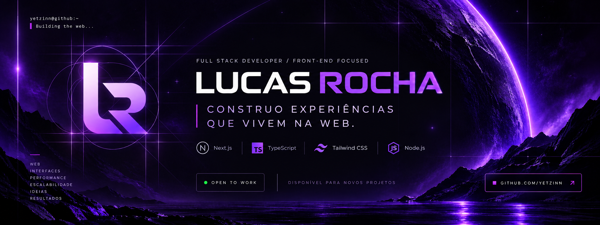

<div align="center">
  
</div>

<br />

<div align="center">

### Full Stack Developer · Front-end focused

Construindo interfaces modernas, performáticas e bem estruturadas para a web.

[](https://github.com/yetzinn)
[](mailto:dev.lucassrocha@gmail.com)

</div>

<br />

## `01 / SOBRE`

Sou **Lucas Rocha**, Full Stack Developer com foco em **Front-end**.

Gosto de transformar ideias em experiências digitais com atenção especial à interface, arquitetura, performance, responsividade e qualidade do código.

Atualmente estou desenvolvendo projetos próprios para aprofundar meus conhecimentos e construir experiências cada vez mais completas para a web.

```ts
const lucas = {
    role: "Full Stack Developer",
    focus: "Front-end",
    location: "Web",
    currentlyBuilding: "Zyvora Hosting",
    openToWork: true,
};
```

<br />

## `02 / STACK`

<div align="center">


</div>

<br />

**Principal**

`Next.js` · `TypeScript` · `Tailwind CSS` · `Node.js`

**Também utilizo**

`React` · `Tailwind Variants` · `Motion` · `Git` · `GitHub`

<br />

## `03 / BUILDING`

### Zyvora Hosting

Plataforma de hospedagem para servidores **MTA**, construída para reunir toda a experiência do produto em uma única aplicação.

O projeto inclui:

- Landing page e apresentação dos planos
- Fluxo de contratação e checkout
- Dashboard do cliente
- Gerenciamento de serviços
- Pedidos e notificações
- Painel administrativo
- Gerenciamento de clientes, planos e serviços

**Stack**

`Next.js` · `TypeScript` · `Tailwind CSS` · `Node.js`

> Status: **Em desenvolvimento**

<br />

## `04 / GITHUB`

<div align="center">
  

  
</div>

<br />

## `05 / PRINCÍPIOS`

```text
INTERFACES       → claras e consistentes
RESPONSIVIDADE   → pensada desde o início
PERFORMANCE      → parte da experiência
COMPONENTIZAÇÃO  → reutilização com propósito
ANIMAÇÃO         → movimento sem excesso
CÓDIGO           → organização antes de abstração
```

<br />

## `06 / CONTATO`

Estou aberto a oportunidades para trabalhar com desenvolvimento web e continuar evoluindo como desenvolvedor.

**Email:** [dev.lucassrocha@gmail.com](mailto:dev.lucassrocha@gmail.com)  
**GitHub:** [@yetzinn](https://github.com/yetzinn)

<br />

---

<div align="center">

`BUILDING FOR THE WEB.`

<sub>Lucas Rocha · Full Stack Developer</sub>

</div>
